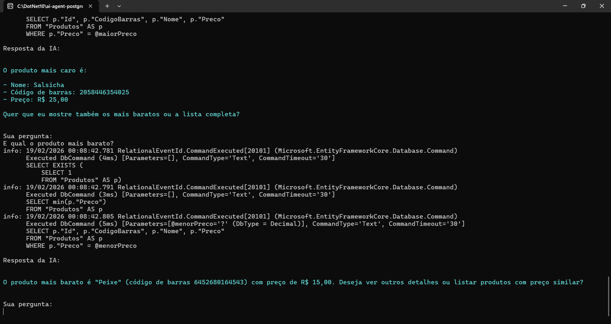
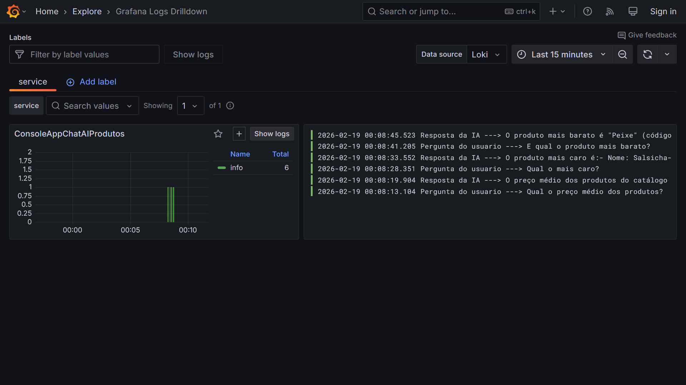
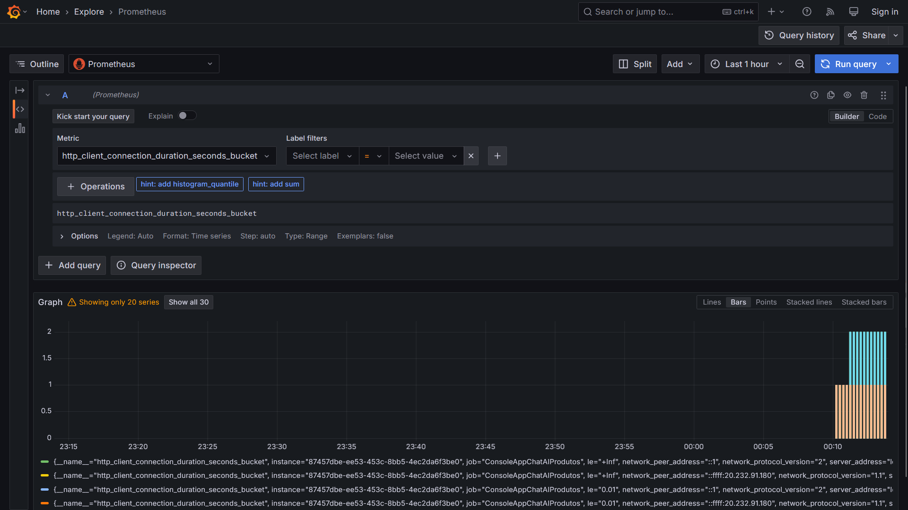
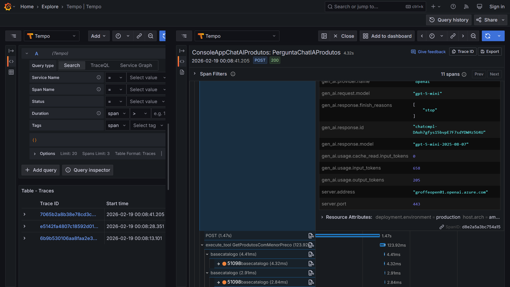

# dotnet10-agent-framework-postgres-testcontainers-otel-grafana_consultaprodutos-v2
Exemplo em .NET 10 de Console Application que faz uso do projeto Microsoft Agent Framework, com integração com soluções de IA como Microsoft Foundry na consulta de informações de produtos em uma base PostgreSQL. Inclui o uso do Testcontainers para criação do ambiente de testes com os dados + observabilidade com Grafana + OpenTelemetry.

Aplicação em execução:

Visualizando logs do Grafana Loki:

Métricas enviadas para o Prometheus:

Traces no Grafana Tempo:

